# JobMonitor

**JobMonitor** is a real-time analytics platform that collects and analyzes tech job offers from online sources.
It identifies trends in technologies, locations, and job types (on-site / remote), and exposes the data via an API and visual dashboard.

## 🔍 Features

- Scrape and parse job offers from multiple sources (Indeed, WTTJ, etc.)
- Extract technologies, companies, and job types
- Store structured data
- Expose an API to query and analyze job trends
- Visual dashboard with top technologies by city or job type

## 📊 Mermaid

```mermaid
flowchart TD
    A["🌍 Job Platforms<br>Indeed, WTTJ, etc."] --> B["🧲 Ingestion Layer<br> src/ingestion"]
    B --> C["🧹 Processing Layer<br> src/processing"]
    C --> D["💾 Storage Layer<br> data/processed"]
    D --> E["🛰️ REST API<br> src/api - FastAPI"] & F["📊 Dashboard<br> Streamlit - optional"]
    G["📄 CV Parser<br> PDF/Text"] --> H["🧠 Compatibility Engine<br>Tech matching + score"]
    D --> H
    H --> F
```

